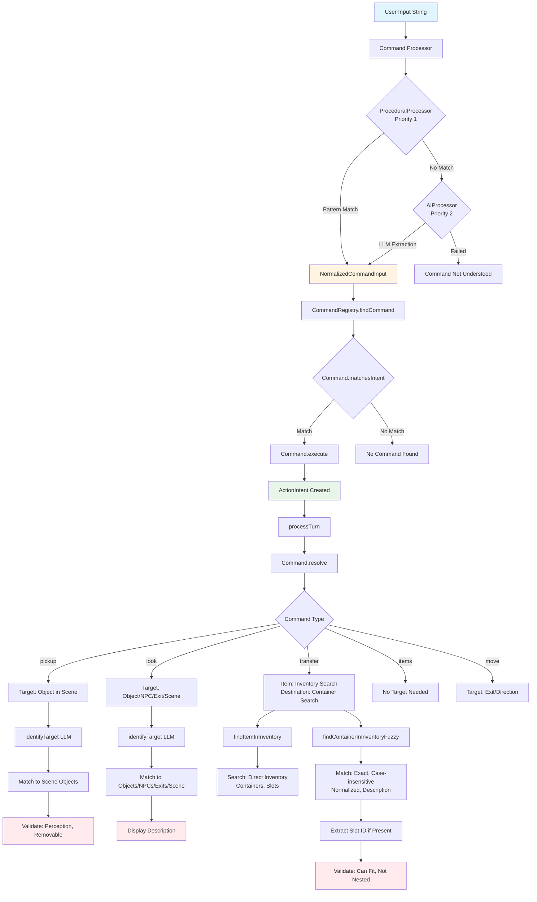

# Object Tracking and Inventory System

This document describes how objects are tracked, how inventory is managed, and how commands identify targets and destinations for object-related operations.

## Command Identification and Target Resolution Flow

The following diagram illustrates how commands are identified and how targets/destinations are found:



## Objects System

Objects can exist in scenes and be picked up by players:

### Object Attributes

Each object has the following attributes:

- **`id`**: Unique identifier for the object
- **`weight`**: Weight of the object (used for carrying capacity calculations)
- **`perception`**: Minimum perception stat required to notice the object. Objects with `perception` > character's current `perception` stat are not visible.
- **`removable`**: Whether the object can be picked up (boolean)
- **`description`**: Text description shown when looking at the object
- **`traits`**: Array of trait strings (e.g., `["container"]`, `["strength_5"]`)
- **`quantity`**: Number of items (defaults to 1)
- **Dimensions** (optional): `width`, `height`, `depth` for dimensional constraints
- **`statModifiers`**: Continuous stat modifiers applied while the object is carried
- **`carryEffects`**: Effects applied when the object is successfully picked up (one-time)
- **`viewEffects`**: Effects applied when the object is looked at
- **`proximityEffect`**: Effects applied automatically when entering a scene containing the object

### Perception System

Objects with `perception` > character's current `perception` stat are not visible. The `getVisibleObjects()` function filters objects based on current perception (calculated via `StatCalculator`). This allows for hidden objects that require higher perception to discover.

### Object Stat Modifiers

Objects can have `statModifiers` that continuously modify character stats while carried. These modifiers are applied during stat calculation and stack with other modifiers. For example, a "strength_ring" might add +2 to strength while worn.

### Object Effects

Objects can have three types of effects:

1. **`carryEffects`**: Applied when the object is successfully picked up (one-time effects)
2. **`viewEffects`**: Applied when the object is looked at (via "look" action)
3. **`proximityEffect`**: Applied automatically when entering a scene containing the object

## Inventory System

### Character Inventory

Character inventory is stored as an array of `InventoryEntry` objects in `CharacterState.inventory`. Each entry contains:

- **`id`**: Item identifier
- **`quantity`**: Number of items (defaults to 1)
- **`objectData`**: Full `ObjectDefinition` for the item (needed for traits, description, stat modifiers, etc.)

### Hand-Held Items

Characters can hold up to 2 items in their hands. Each hand is represented as a container:

- **"left-hand"** and **"right-hand"** containers
- Each hand has 5 ring slots (for small items like rings) plus general storage
- General storage can hold one item (`maxItems: 1`)
- Containers don't use hand-held slots

### Container System

Objects with the "container" trait can hold other objects, subject to constraints:

#### Weight Constraints

Container has a `maxWeight` attribute. Total weight of all items in container (including nested items and items in slots) must not exceed this.

#### Item Count Constraints

Container has a `maxItems` property that limits the number of items in general storage (not counting slots).

#### Dimensional Constraints

Container has `width`, `height`, `depth` properties. Sum of dimensions of all items in general storage must fit within these limits.

#### Container Strength

Containers can have strength traits (e.g., "strength_5") that add to character's effective strength for carrying capacity calculations. This allows backpacks and other containers to increase the character's carrying capacity.

#### Container Slots

Containers can have named slots, each of which can hold exactly one item. Slots have their own weight and dimensional constraints (`maxWeight`, `width`, `height`, `depth`). Items in slots are displayed separately from general container storage when looking at containers or viewing inventory.

**Slot Definition**:
```typescript
interface SlotDefinition {
    id: string;                    // Unique identifier within the container
    name?: string;                 // Display name (optional, defaults to id)
    maxWeight?: number;            // Maximum weight capacity for this slot
    width?: number;                // Width dimension constraint
    height?: number;               // Height dimension constraint
    depth?: number;                // Depth dimension constraint
    itemId: string | null;         // ID of the item currently in the slot, or null if empty
}
```

Slots are useful for organizing specific item types (e.g., weapon sheaths, ring slots on hands). Items can be transferred to specific slots using the transfer command (e.g., "put sword in backpack sheath slot").

### Carrying Capacity

Based on the character's `strength` stat (capacity = strength × 10). Containers with strength traits add to effective strength. The `getEffectiveStrength()` function calculates character strength including container strength bonuses.

## Commands

### Look Command (`look`)

**Command ID**: `look`  
**Aliases**: "search", "l"

#### Purpose
Displays scene narrative, visible objects, visible NPCs, and visible exits. Can also be used to examine specific objects, NPCs, exits, or containers in inventory.

#### Target Identification
1. If no target specified, shows general scene overview
2. If target specified:
   - Uses `identifyTarget()` LLM function to extract target from input
   - Matches against:
     - **Objects in scene**: By ID or description (case-insensitive, partial match)
     - **NPCs in scene**: By ID or name
     - **Exits**: By direction, name, or description
     - **Scene**: By scene ID or "scene" keyword
     - **Containers in inventory**: By container ID

#### Resolution Process
1. **General Look** (no target):
   - Displays scene narrative
   - Lists all visible objects (filtered by perception)
   - Lists all visible NPCs (filtered by perception and agility)
   - Lists all visible exits (filtered by perception)
   - Applies `viewEffects` from all visible objects

2. **Targeted Look**:
   - For objects: Displays description, detailed descriptions (filtered by perception), and applies `viewEffects`
   - For containers: Displays description, contents (general storage and slots), detailed descriptions
   - For NPCs: Displays description and detailed descriptions
   - For exits: Displays description and detailed descriptions
   - For conversational questions: Uses AI to answer questions about the target

#### Special Features
- **Conversational Questions**: If input appears to be a question (contains question words or "?"), uses AI to generate contextual answers
- **Perception Filtering**: Only shows objects/NPCs/exits that the character can perceive
- **View Effects**: Automatically applies `viewEffects` when looking at objects

### Inventory Command (`items`)

**Command ID**: `items`  
**Aliases**: "inventory", "inv", "i"

#### Purpose
Lists all items in inventory with their container and slot information.

#### Target Identification
No target needed - command has no parameters.

#### Resolution Process
1. Builds comprehensive objects map from:
   - Inventory entries
   - Container contents (recursively)
   - Scene objects (for items that might be in slots)
2. Uses `getAllItemsWithContainers()` to get all items with their location information
3. Formats output showing:
   - Item ID and quantity
   - Container name (e.g., "left hand", "right hand", "backpack")
   - Slot name if item is in a slot (e.g., "sheath slot", "ring-1")

#### Output Format
```
Inventory:
  - sword (left hand)
  - torch (right hand)
  - key (backpack)
  - ring (left hand, ring-1 slot)
```

### Pickup Command (`pickup`)

**Command ID**: `pickup`  
**Aliases**: "pick up", "grab", "take", "get"

#### Purpose
Picks up objects from scenes and adds them to inventory.

#### Target Identification
1. Uses `identifyTarget()` LLM function to extract target object from input
2. Matches target string against scene objects:
   - Exact ID match (case-insensitive)
   - Description contains target (case-insensitive)
3. Validates object exists in scene

#### Resolution Process
1. **Validation Checks**:
   - Object exists in scene
   - Character has sufficient perception to see object (`object.perception <= character.perception`)
   - Object is removable (`object.removable === true`)
   - Character has carrying capacity (checks effective strength including container bonuses)
   - Object fits in available container (weight, dimensions, item count)

2. **Container Finding**:
   - Uses `findContainerInInventory()` to find first container that can hold the item
   - Checks weight constraints (including nested items and slot contents)
   - Checks dimensional constraints (for general storage)
   - Checks item count constraints (for general storage)

3. **Success**:
   - Creates `InventoryEntry` with object data
   - Adds to `addItems` effect
   - Merges `carryEffects` from object
   - Returns success narrative

#### Error Messages
- "Pick up what?" - No target identified
- "I don't see [object] here." - Object not in scene
- "You don't notice anything special here." - Perception too low
- "You can't pick up [object]." - Object not removable
- "You don't have a container that can hold this item." - No suitable container
- "[Object] doesn't fit in your [container]." - Item doesn't fit (weight/dimensions)

### Transfer Command (`transfer`)

**Command ID**: `transfer`  
**Aliases**: "switch", "move"

#### Purpose
Transfers items between containers in inventory, including moving items to specific slots.

#### Target Identification

**Item Identification**:
1. Uses AI to extract `itemId` from input
2. Uses `findItemInInventory()` to locate item:
   - Searches direct inventory (items not in containers)
   - Searches container `contains` arrays (general storage)
   - Searches container slots
   - Returns item, container ID, and slot ID if applicable

**Destination Identification**:
1. Uses AI to extract `destinationContainerId` from input
2. Parses slot reference if present (e.g., "backpack sheath slot" → container: "backpack", slot: "sheath")
3. Uses `findContainerInInventoryFuzzy()` to find container:
   - **Exact match**: Container ID matches exactly
   - **Case-insensitive match**: Container ID matches ignoring case
   - **Normalized match**: Handles "right hand" vs "right-hand" by removing spaces/hyphens/underscores
   - **Description match**: Search term appears in container description (case-insensitive and normalized)

**Slot Parsing**:
- Extracts slot ID from destination string using patterns:
  - "container slot" → slot: "slot"
  - "container.slot" → slot: "slot"
  - "container slot-name" → slot: "slot-name"
  - "left-hand ring-1" → container: "left-hand", slot: "ring-1"
- Uses `findSlotByIdOrName()` to match slot by ID or name (case-insensitive)

#### Resolution Process
1. **Validation Checks**:
   - Item exists in inventory
   - Destination container exists
   - Not transferring to same container
   - Destination is actually a container (has "container" trait)
   - Not transferring container into itself
   - Not transferring container into nested container

2. **Slot Transfer** (if slot specified):
   - Finds slot in destination container
   - Checks slot is not already occupied
   - Validates item fits in slot (`canFitInSlot()`):
     - Weight constraint (if slot has `maxWeight`)
     - Dimensional constraints (if slot has dimensions)

3. **General Storage Transfer** (if no slot specified):
   - Validates item fits in container (`canFitInContainer()`):
     - Item count constraint (if container has `maxItems`)
     - Weight constraint (including slot contents)
     - Dimensional constraints (sum of dimensions)

4. **Success**:
   - Creates `transferItem` effect with:
     - `itemId`: Item to transfer
     - `fromContainerId`: Source container (null if directly in inventory)
     - `toContainerId`: Destination container
     - `slotId`: Slot ID if transferring to slot (optional)

#### Error Messages
- "Transfer what to where?" - Missing item or destination
- "I don't see that item in your inventory." - Item not found
- "That container doesn't exist." - Container not found
- "The [item] is already in [container]." - Same container
- "That's not a container." - Destination not a container
- "You can't transfer a container into itself." - Self-transfer
- "You can't transfer a container into one of its nested containers." - Nested transfer
- "That slot doesn't exist in [container]." - Slot not found
- "The [slot] slot is already occupied." - Slot occupied
- "The [item] doesn't fit in the [slot] slot." - Item doesn't fit in slot
- "The [item] doesn't fit in your [container]." - Item doesn't fit in container

### Move Command (`move`)

**Command ID**: `move`  
**Aliases**: "go", "walk", "travel"

#### Purpose
Moves between scenes via exits.

#### Target Identification
1. Uses AI to extract direction from input
2. Maps natural language to direction abbreviations:
   - "north", "go north", "move north", "n" → `n`
   - "south", "go south", "move south", "s" → `s`
   - "west", "go west", "move west", "w" → `w`
   - "east", "go east", "move east", "e" → `e`
   - "northwest", "go northwest", "nw" → `nw`
   - Similar for other directions
3. Validates direction matches an available exit in scene

#### Resolution Process
1. **Validation Checks**:
   - Exit exists for direction
   - Exit has `nextSceneId`
   - Exit requirements are met (if present):
     - Stat thresholds
     - Trait/flag presence
     - Item availability

2. **Success**:
   - Returns narrative describing movement
   - Sets `nextSceneId` in resolution result
   - Engine applies scene transition

#### Error Messages
- "Move where?" - No direction specified
- "You can't go [direction] from here." - No exit in that direction
- "[Requirement reason]" - Exit requirements not met

## Container Utilities

The `src/core/container.ts` module provides utility functions for container and inventory management:

### Finding Functions

- **`findItemInInventory()`**: Searches through all inventory entries and their containers to find an item by ID, returning the item and its container ID.
- **`findContainerInInventoryFuzzy()`**: Finds containers using fuzzy matching (exact, case-insensitive, normalized, description).
- **`findContainerInInventory()`**: Finds the first container that can hold an item.
- **`findSlotInContainer()`**: Finds a slot by ID within a container.

### Validation Functions

- **`canFitInContainer()`**: Validates if an item can fit in a container based on weight, item count, and dimensional constraints (for general storage).
- **`canFitInSlot()`**: Validates if an item fits in a specific slot based on weight and dimensional constraints.
- **`calculateContainerWeight()`**: Recursively calculates total weight of a container including all nested items and items in slots.

### Query Functions

- **`getAllItemsWithContainers()`**: Returns all items from inventory with their container and slot information.
- **`getAvailableSlots()`**: Returns all empty slots in a container.
- **`getSlotContents()`**: Returns all items currently in slots.
- **`getAvailableContainerSpace()`**: Gets available space in a container (weight and dimensions).

### Strength Functions

- **`getEffectiveStrength()`**: Calculates character strength including container strength bonuses. Uses current strength stat (via `StatCalculator`).

### Creation Functions

- **`createHandContainers()`**: Creates "left-hand" and "right-hand" container objects with 5 ring slots each.

## Data Flow

### Adding Items to Inventory

1. **Pickup Command** validates object can be picked up
2. **Resolution** creates `addItems` effect with `InventoryEntry`
3. **`applyEffects()`** in `resolution.ts`:
   - Finds appropriate container using `findContainerInInventory()`
   - Adds item to container's `contains` array
   - Updates inventory entry with container reference

### Transferring Items

1. **Transfer Command** validates item and destination
2. **Resolution** creates `transferItem` effect
3. **`applyEffects()`** in `resolution.ts`:
   - Finds item in source location (container or direct inventory)
   - Removes item from source
   - Adds item to destination container (general storage or slot)
   - Updates container entries in inventory

### Removing Items from Inventory

1. Command creates `removeItems` effect
2. **`applyEffects()`** in `resolution.ts`:
   - Finds item in inventory (direct or in container)
   - Removes from inventory entry or container's `contains` array
   - Updates inventory

## Object Location Tracking

Objects can be located in several places:

1. **Scene Objects**: `GameState.sceneObjects[sceneId]` - Objects in the current scene
2. **Direct Inventory**: `CharacterState.inventory` entries that are not containers
3. **Container General Storage**: `container.contains` array
4. **Container Slots**: `container.slots[].itemId` - Items in named slots

The `findItemInInventory()` function searches all these locations to find an item.

