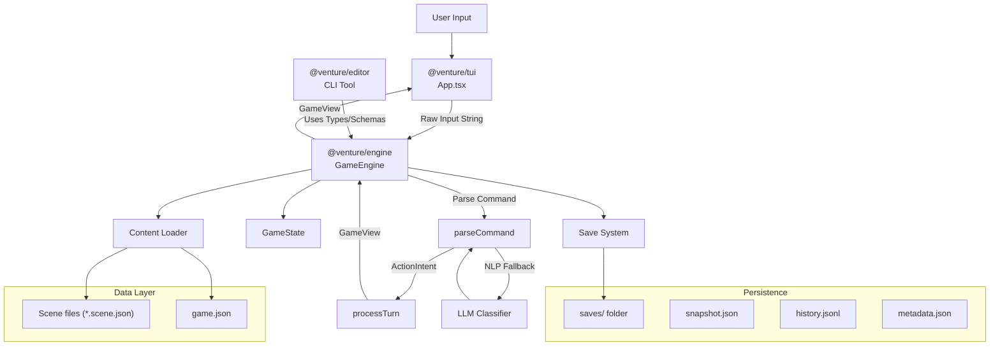

# Venture TUI Game: Architecture

## High-Level Overview

Venture is a modular text-adventure engine designed for separation of concerns between the **Game Engine** (logic) and the **User Interface** (presentation). It supports data-driven content, NLP-enhanced command parsing, and robust state management.

See `packages/engine/docs/command-architecture.md` for a detailed walkthrough of command interpretation, targets/destinations, and the procedural vs AI processor flow.



## Core Layers

### 1. The Engine (`packages/engine/`)
The engine package (`@venture/engine`) is "headless" and UI-agnostic. It manages:
-   **State**: The immutable-ish `GameState` object.
-   **Logic**: Processing turns (`processTurn`), resolving actions via command classes, and applying effects (`applyEffects`).
-   **Command Parsing**: All command parsing is handled by `parseCommand` in `command.ts`, which integrates scene choices, game globals, and engine globals.
-   **Loading**: Reading game content from the `games/` directory.
-   **Validation**: Checking action requirements (`validateRequirements`).
-   **Configuration**: Game configuration via `config/index.ts` (currently returns defaults).
-   **Type Exports**: All TypeScript types are exported for use by TUI and editor packages.
-   **Schema Exports**: JSON schemas are available for validation in the editor.

#### GameEngine (`packages/engine/src/game-engine.ts`)
The `GameEngine` class provides a high-level API that encapsulates game content and state management:
-   **Manages Game Content**: Loads and holds scenes and manifest internally.
-   **Processes Input**: Takes raw user input strings and returns `GameView` objects.
-   **Assembles Context**: Automatically builds `SceneContext` with scene objects, exits, game globals, and engine globals.
-   **State Management**: Maintains `GameState` and provides methods for save/load operations.
-   **View Model**: Returns `GameView` containing everything the UI needs to display.

#### Resolution System (`packages/engine/src/resolution.ts`)
The `applyEffects()` function applies `ActionEffects` to game state:
-   **Stat Modifications**: Applies stat deltas to character stats.
-   **Trait Management**: Adds or removes traits from character.
-   **Flag Management**: Adds or removes flags from world state.
-   **Inventory Management**: 
    -   `addItems`: Adds items to inventory, automatically finding appropriate containers
    -   `removeItems`: Removes items from inventory
    -   `transferItem`: Moves items between containers or from direct inventory to containers
-   **Scene Transitions**: Updates `currentSceneId` when `nextSceneId` is provided.
-   **Object Removal**: Removes picked-up objects from scene objects.

### 2. The UI (`packages/tui/`)
Built with **Ink** (React for Terminal), the UI layer is a "dumb renderer":
-   **Renders**: Displays `GameView` data (Narrative, Choices, Stats, Log).
-   **Captures Input**: Collects raw user input strings via `InputPanel`.
-   **Delegates Processing**: Passes all input to `GameEngine.processInput()`.
-   **Manages Application Modes**: Handles UI-level concerns (`initializing`, `selection`, `loading`, `playing`, `error`).
-   **No Business Logic**: All game logic, command parsing, and state management is handled by the engine.

### 3. The Editor (`packages/editor/`)
A CLI tool for creating and validating game content:
-   **Commands**: `new-game`, `new-scene`, `validate`, `validate-scene`
-   **Uses Engine Types**: Imports types and schemas from `@venture/engine` for validation
-   **Interactive Prompts**: Uses `prompts` library for user input when creating games/scenes

### 4. Content System (`games/`)
Games are self-contained modules.
-   **Structure**:
    -   `games/<id>/game.json`: Metadata and game-specific configurations.
    -   `games/<id>/scenes/*.scene.json`: Scene definitions.
-   **Hot-loading**: The engine loads content dynamically at runtime.

## Key Subsystems

### Command Processing
**Implementation**: All command parsing is handled by the engine layer through `GameEngine.processInput()` using a plugin-based command processor system.

The command processing pipeline:
1.  **Input Collection**: UI captures raw user input string and passes it to `GameEngine.processInput()`.
2.  **Context Assembly**: `GameEngine` automatically builds `SceneContext` by merging:
    -   **Scene Objects**: Objects in the current scene (filtered by perception).
    -   **Scene Exits**: Exits from the current scene (filtered by perception).
    -   **Game Globals**: From `game.json` `globalActions` field.
    -   **Engine Globals**: Built-in actions from `src/core/globals.ts` (e.g., "look", "items", "pickup", "move", "transfer").
3.  **Command Processing**: `parseCommand()` function in `command.ts` uses a plugin-based `CommandProcessor` system:
    -   **ProceduralProcessor** (Priority 1): Fast pattern matching for common commands:
        -   Pickup commands: "pick up <object>", "grab <object>", "take <object>", "get <object>"
        -   Look commands: "look", "look at <target>"
        -   Move commands: "go <direction>", "move <direction>", or just direction names
        -   Direct ID/alias matching for engine globals
    -   **AIProcessor** (Priority 2): LLM-based fallback for ambiguous or complex commands:
        -   Uses command schemas from `CommandRegistry` to extract structured parameters
        -   Handles natural language variations (e.g., "switch sword to right hand" → transfer command)
        -   Distinguishes between context-dependent commands (e.g., "move north" vs "move sword")
4.  **Command Execution**: Normalized command input is passed to the appropriate `Command` class:
    -   Each command implements the `Command` interface with `execute()` and `resolve()` methods
    -   `execute()` creates an `ActionIntent` with `type` set to the command ID (e.g., `'look'`, `'pickup'`, `'move'`)
    -   `resolve()` produces `ResolutionResult` with narrative and effects
5.  **Command Identification**: In `processTurn()`, the engine uses `CommandRegistry.findCommand()` to match intents to commands:
    -   Iterates through all registered commands
    -   Calls `matchesIntent(intent)` on each command to find the one that handles the intent
    -   Each command's `matchesIntent()` checks if `intent.type === this.getCommandId()`
    -   Returns the matching command or null if no command matches
6.  **Turn Processing**: `processTurn()` calls the matched command's `resolve()` method, validates requirements, and applies effects.
7.  **View Return**: `GameEngine` returns updated `GameView` with new state and narrative.

**Command Classes**: Commands are implemented as classes registered in `CommandRegistry`:
-   `LookCommand`: Displays scene narrative, visible objects, and visible exits
-   `InventoryCommand`: Lists all items in inventory with their containers
-   `PickupCommand`: Picks up objects from scenes and adds them to inventory
-   `MoveCommand`: Moves between scenes via exits
-   `TransferCommand`: Transfers items between containers in inventory

**Key Points**:
-   All business logic is in the engine layer.
-   Engine Global Actions are fully integrated and accessible.
-   UI is completely decoupled from game logic.
-   Command processing is extensible via the plugin system.

### Save & Load
-   **Format**: JSON-based.
-   **Structure**: `saves/<gameId>_<timestamp>/`.
    -   **Snapshot** (`snapshot.json`): Full `GameState` dump. Handles `Set` serialization via custom replacer/reviver (`{ $type: 'Set', value: [...] }`).
    -   **History** (`history.jsonl`): Line-delimited JSON of every `ActionIntent` taken, for replayability/audit.
    -   **Metadata** (`metadata.json`): Lightweight info for UI listing. Contains:
        -   `id`: The save folder name (e.g., `"demo_1709123456"`)
        -   `gameId`: The game identifier (e.g., `"demo"`)
        -   `timestamp`: Unix timestamp of when the save was created
        -   `turn`: The turn number at save time
        -   `characterName`: The character's name
        -   `currentSceneId`: The scene ID where the game was saved

### Global Actions
-   **Engine Globals**: Defined in `packages/engine/src/globals.ts`. Built-in actions available everywhere:
    -   `look`: Display scene narrative, visible objects, and visible exits (aliases: "search", "l")
    -   `items`: List inventory with container information (aliases: "inventory", "inv", "i")
    -   `pickup`: Pick up objects from scenes (aliases: "pick up", "grab", "take", "get")
    -   `move`: Move between scenes via exits (aliases: "go", "walk", "travel")
    -   `transfer`: Transfer items between containers (aliases: "switch", "move")
    -   `effects`: Display active effects on character (aliases: "status", "conditions", "affects")
-   **Game Globals**: Defined in `game.json` via the `globalActions` field. These are game-specific actions that are automatically merged with engine globals by `GameEngine`.

### Objects and Inventory Management
The engine supports objects that can exist in scenes and be picked up by players:

-   **Objects in Scenes**: Objects are defined in scene JSON files with attributes like weight, dimensions, perception requirements, and effects.
-   **Pickup Action**: The "pickup" global action (aliases: "pick up", "grab", "take", "get") allows players to pick up objects by name (e.g., "pick up sword").
-   **Perception System**: Objects have a `perception` attribute that determines if they're visible based on the character's perception stat. Exits also have a `perception` attribute for visibility.
-   **Carrying Capacity**: Based on the character's `strength` stat (capacity = strength × 10). Containers with strength traits add to effective strength.
-   **Hand Containers**: Characters have "left-hand" and "right-hand" containers that can each hold one item (via `maxItems: 1`). Hands are treated as regular containers with no special logic.
-   **Container System**: Objects with the "container" trait can hold other objects, subject to:
    -   **Weight Constraints**: `maxWeight` property limits total weight
    -   **Item Count Constraints**: `maxItems` property limits number of items
    -   **Dimensional Constraints**: `width`, `height`, `depth` properties limit physical size
-   **Transfer Action**: The "transfer" global action (aliases: "switch", "move") allows moving items between containers:
    -   Example: "switch sword to right hand" or "transfer sword to backpack"
    -   Uses fuzzy matching to find containers by ID or description (handles "right hand" vs "right-hand")
    -   Validates that items fit in destination containers
    -   Prevents transferring containers into themselves or nested containers
-   **Object Effects**: Objects can have `carryEffects` (applied when picked up), `viewEffects` (applied when looked at), and `proximityEffect` (applied when in scene).
-   **Object Stat Modifiers**: Objects can have `statModifiers` that continuously modify character stats while carried. These are applied during stat calculation and stack with other modifiers.

## Data Models

### `GameState`
The single source of truth for game state.

```typescript
interface GameState {
    characters: Record<string, CharacterState>; // All characters (player and NPCs)
    world: WorldState;             // Global flags, Visited scenes, Turn count
    currentSceneId: string;
    log: LogEntry[];               // Turn-by-turn log
    rngSeed: number;                // For deterministic re-rolls/checks if needed
    actionHistory: ActionIntent[]; // All actions taken (with timestamps added during processing)
    sceneObjects: Record<SceneId, ObjectDefinition[]>; // Objects in each scene
    effectDefinitions?: Record<string, EffectDefinition>; // Game-specific effect definitions
}
```

### `ActionIntent`
Represents a player's intended action. The `timestamp` field is added automatically by `processTurn` in `engine.ts` when recording the action to `actionHistory`.

```typescript
interface ActionIntent {
    actorId: string;      // usually "player"
    type: string;         // Command ID - must match a command from the command registry (e.g., 'look', 'pickup', 'move')
    sceneId?: string;     // Context: which scene is this from (validation)
    itemId?: string;      // For use_item commands or transfer commands
    targetId?: string;    // Optional target (object ID for pickup, direction for move, container ID for transfer)
    timestamp?: number;   // Added during processing in engine.ts
    originalInput?: string; // Original user input for AI fallback in commands
}
```

**Command Identification**: Commands are identified by their command ID (string). The `CommandRegistry.findCommand()` method iterates through all registered commands and calls `matchesIntent()` on each one to find the command that handles the intent. Each command implements `matchesIntent()` to check if the intent's `type` matches its command ID.

### `ActionEffects`
Effects that modify game state when applied:

```typescript
interface ActionEffects {
    stats?: Partial<Record<keyof StatBlock, number>>; // Stat deltas (applied to baseStats)
    addTraits?: TraitId[];
    removeTraits?: TraitId[];
    addFlags?: FlagId[];
    removeFlags?: FlagId[];
    addItems?: InventoryEntry[]; // Items to add to inventory
    removeItems?: InventoryEntry[]; // Items to remove from inventory
    addEffects?: string[]; // Effect IDs to apply
    removeEffects?: string[]; // Effect IDs to remove
    targetCharacterId?: string; // Character ID to apply effects to (defaults to actorId)
    transferItem?: {
        itemId: string;
        fromContainerId: string | null; // null if item is directly in inventory
        toContainerId: string; // destination container ID
    };
    hiddenConsequences?: string[];
    reprintNarrative?: boolean;
    listInventory?: boolean;
}
```

**Transfer Effect**: The `transferItem` effect moves an item from one container to another (or from direct inventory to a container). The resolution system handles:
-   Finding the item in its current location (container or direct inventory)
-   Removing it from the source location
-   Adding it to the destination container's `contains` array
-   Updating container entries in inventory

### `SceneDefinition`
```typescript
interface SceneDefinition {
    id: string;
    narrative: string;
    objects?: ObjectDefinition[]; // Objects in the scene
    exits?: ExitDefinition[]; // Exits to other scenes
}
```

### `ExitDefinition`
Exits define ways to move between scenes:

```typescript
interface ExitDefinition {
    direction: Direction; // 'n' | 's' | 'w' | 'e' | 'nw' | 'ne' | 'sw' | 'se'
    type?: 'opening' | 'door' | string; // Optional type (opening, door, etc.)
    name?: string; // Optional descriptive name (e.g., "archway")
    description?: string; // Optional full description
    nextSceneId: string; // The scene to transition to
    requirements?: ActionRequirements; // Optional requirements to use this exit
    perception?: number; // Perception required to notice this exit (defaults to 0)
}
```

### `ObjectDefinition`
Objects that can exist in scenes and be picked up:

```typescript
interface ObjectDefinition {
    id: string;
    quantity?: number; // Defaults to 1
    weight: number;
    perception: number; // Minimum perception to notice
    removable: boolean; // Whether it can be picked up
    description: string;
    traits: string[]; // Array of trait strings (e.g., ["container"])
    statModifiers?: Partial<StatBlock>; // Continuous stat modifiers while carried
    carryEffects?: ActionEffects; // Effects when picked up
    viewEffects?: ActionEffects; // Effects when looked at
    proximityEffect?: ActionEffects; // Effects when in scene
    contains?: ObjectDefinition[]; // Nested objects (if container)
    maxWeight?: number; // Max weight for containers
    maxItems?: number; // Max number of items for containers
    width?: number; // Width dimension
    height?: number; // Height dimension
    depth?: number; // Depth dimension
}
```

### `CharacterState`
```typescript
interface CharacterState {
    id: string;
    name: string;
    baseStats: StatBlock; // Immutable base stat values
    stats: StatBlock; // Current calculated stats (base + object modifiers + effect modifiers)
    traits: Set<TraitId>;
    inventory: InventoryEntry[]; // Contains all items including hand containers
    flags: Set<FlagId>;
    effects: CharacterEffect[]; // Active effects on this character
}
```

**Note**: Hand-held items are managed through container entries in `inventory`. The "left-hand" and "right-hand" containers are created during initial state and can each hold one item via the `maxItems` property.

**Base vs Current Stats**: Base stats are the immutable foundation values for a character. Current stats are calculated dynamically from base stats + object stat modifiers + effect static modifiers. Per-turn effect modifiers modify base stats directly (cumulative), while static modifiers are applied during stat calculation.

### `GameView`
Complete view model returned by `GameEngine` containing everything the UI needs to display:

```typescript
interface GameView {
    state: GameState;
    currentSceneNarrative: string;
    errorMessage?: string;  // For validation/parsing errors
    normalizedInput?: NormalizedCommandInput; // For debugging - last normalized command input
}
```

**Note**: Available choices are no longer part of `GameView`. Commands are discovered through the `CommandRegistry` and global actions. The UI can query available commands if needed, but typically displays narrative and accepts free-form input.

### `SaveMetadata`
Metadata stored in each save folder's `metadata.json`:

```typescript
interface SaveMetadata {
    id: string;           // The folder name (e.g., "demo_1709123456")
    gameId: string;       // The game identifier (e.g., "demo")
    timestamp: number;    // Unix timestamp of when the save was created
    turn: number;         // The turn number at save time
    characterName: string;
    currentSceneId: string;
}
```

## Additional Systems

### Container Utilities (`packages/engine/src/container.ts`)
Provides utility functions for container and inventory management:

-   **`findItemInInventory()`**: Searches through all inventory entries and their containers to find an item by ID, returning the item and its container ID.
-   **`findContainerInInventoryFuzzy()`**: Finds containers using fuzzy matching:
    -   Exact ID match
    -   Case-insensitive ID match
    -   Normalized match (handles "right hand" vs "right-hand" by removing spaces/hyphens/underscores)
    -   Description matching (case-insensitive and normalized)
-   **`canFitInContainer()`**: Validates if an item can fit in a container based on weight, item count, and dimensional constraints.
-   **`calculateContainerWeight()`**: Recursively calculates total weight of a container including all nested items.
-   **`getAllItemsWithContainers()`**: Returns all items from inventory with their container information.

### Configuration (`packages/engine/src/config/index.ts`)
Provides game configuration via `GameConfig` interface. Currently returns default values but can be extended to read from files or environment variables.

```typescript
interface GameConfig {
    title: string;
    difficulty: "easy" | "normal" | "hard";
}
```

### Game Context (`packages/engine/src/context.ts`)
Defines `GameContext` interface as a placeholder for future game state and configuration. Currently minimal, intended to be extended as the game grows.

## Architecture Principles

### Separation of Concerns
-   **Engine Layer**: Contains all business logic, state management, command parsing, and game rules.
-   **UI Layer**: Pure presentation layer that collects input and renders output. No game logic.
-   **Communication**: UI passes raw strings to `GameEngine.processInput()`, receives `GameView` objects.

### Engine Independence
The engine is completely independent of the UI implementation:
-   Can be tested without any UI components.
-   Can be used with different UI frameworks (TUI, web, etc.).
-   All game logic is self-contained in `packages/engine/src/`.

## Future Roadmap
-   [ ] **Replay System**: Re-running a game from `history.jsonl`.
-   [ ] **Web Adapter**: A React-DOM based UI using the same Core.
-   [ ] **Combat System**: Turn-based combat mechanics.
