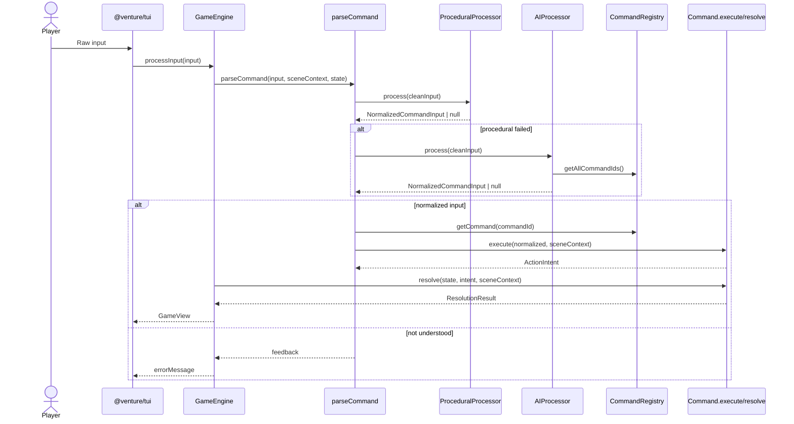
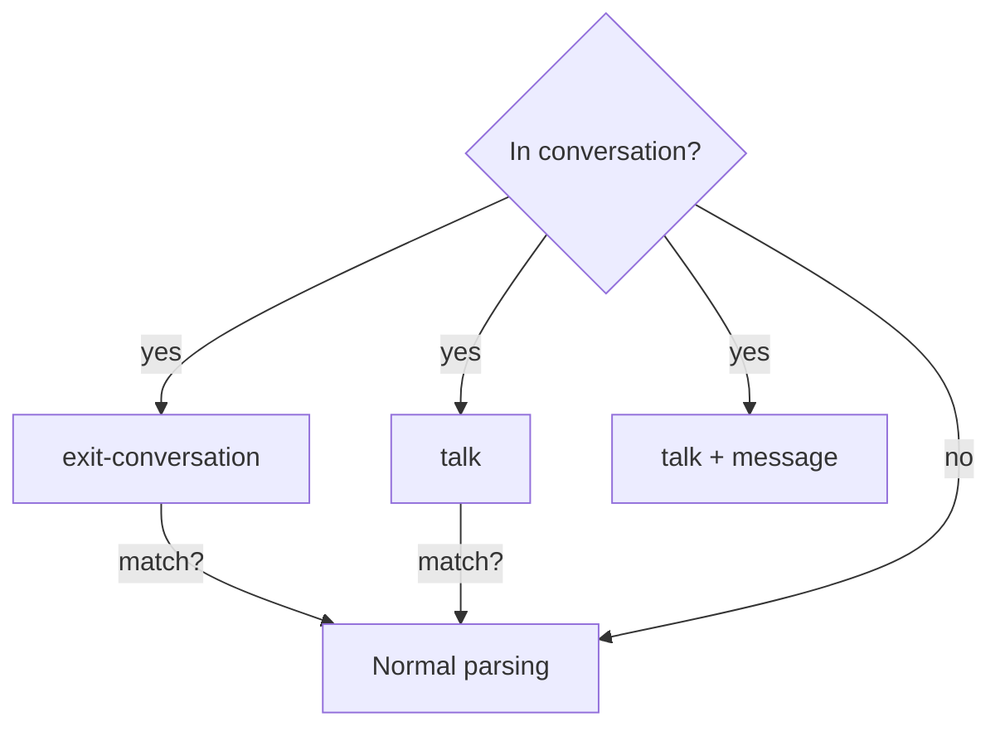

# Command Interpretation Architecture

This document focuses on how player input is interpreted into commands, how targets/destinations are resolved, and how procedural vs AI processing interact.

## Overview



## Command Processor Relationship

- `CommandProcessor` tries processors in priority order.
- `ProceduralProcessor` (priority 1) uses deterministic parsing for common patterns.
- `AIProcessor` (priority 2) is the fallback and uses LLM classification.
- A command can opt out of procedural parsing (return `null`) to force AI handling.

```mermaid
flowchart TD
    Input[Cleaned input]
    Proc[ProceduralProcessor
(priority 1)]
    AI[AIProcessor
(priority 2)]
    Norm[NormalizedCommandInput]
    None[null]

    Input --> Proc
    Proc -- success --> Norm
    Proc -- null --> AI
    AI -- success --> Norm
    AI -- null --> None
```

### AIProcessor specifics

1. Classifies the command ID from the registry (`classifyCommandId`).
2. If confidence is low or missing, defaults to:
   - `query` for question-like input.
   - `look` otherwise.
3. Delegates parameter extraction to the command’s `extractParameters()`.

## Conversation Context Shortcut

`parseCommand()` checks `GameState.currentContext` before normal processing:

- If in conversation, it detects `exit-conversation` or `talk <npc>` and executes immediately.
- Otherwise, it treats input as a conversation message to `talk` and sets `parameters.message`.



## NormalizedCommandInput → ActionIntent Mapping

`NormalizedCommandInput` is the structured command output from processors. `execute()` converts it into an `ActionIntent` for turn resolution.

```mermaid
flowchart LR
    Norm[NormalizedCommandInput
commandId + parameters]
    Exec[Command.execute]
    Intent[ActionIntent
(type, targetId, itemId, sceneId...)]

    Norm --> Exec --> Intent
```

### Common Fields

- `ActionIntent.type`: command ID (string).
- `ActionIntent.targetId`: target entity (object ID, NPC ID, exit direction, container ID).
- `ActionIntent.itemId`: item to transfer (transfer only).
- `ActionIntent.sceneId`: current scene ID for validation.
- `ActionIntent.originalInput`: raw player input for AI fallbacks.

## Command-by-Command Interpretation

### look
- **Target**: object, NPC, exit direction, or scene.
- **Procedural**: supports `look` and `look at <target>`.
- **AI**: uses `identifyTarget()`; attempts matching.
- **ActionIntent**: `targetId` if matched; otherwise string passthrough for error messaging.

### items
- **Target**: none.
- **Procedural**: always succeeds.
- **ActionIntent**: no target fields.

### pickup
- **Target**: object in current scene.
- **Procedural**: matches scene objects by ID/description.
- **AI**: uses `identifyTarget()` and scene object match.
- **ActionIntent**: `targetId = object.id`.

### drop
- **Target**: item in inventory.
- **Procedural**: extracts target string but does not validate.
- **AI**: regex extraction of target phrase.
- **ActionIntent**: `targetId = raw target`; resolve matches inventory/containers/slots.

### move
- **Target**: exit direction (`n`, `s`, `e`, `w`, `nw`, `ne`, `sw`, `se`) or exit name/description.
- **Procedural**: handles direct directions and exit name matching.
- **AI**: uses LLM to map to a direction and validates against available exits.
- **ActionIntent**: `targetId` not used; `parameters.direction` becomes intent routing and exit matching in resolve.

### transfer
- **Target**: destination container (and optional slot). Item comes from inventory.
- **Procedural**: expects `target` + `destination` from NLP parser.
- **AI**: extracts `itemId` and `destinationContainerId` (may include slot phrases).
- **ActionIntent**: `itemId` and `targetId` (destination container string).
- **Resolve**: fuzzy-matches container name, parses slot phrases, validates fit/constraints.

### help
- **Target**: command name (optional).
- **Procedural**: `help <command>` parsing.
- **AI**: extracts a command ID (if any) and validates against registry.
- **ActionIntent**: `targetId = commandId` when present.

### effects
- **Target**: none.
- **Procedural**: always succeeds.
- **ActionIntent**: no target fields.

### query
- **Target**: the question text.
- **Procedural**: intentionally returns null (AI only).
- **AI**: always sets `parameters.question`.
- **ActionIntent**: `originalInput` becomes the question.
- **Resolve**: may re-route to another command if AI detects an action intent with high confidence.

### talk
- **Target**: NPC ID.
- **Procedural**: matches NPC by ID or name and extracts trailing message.
- **AI**: uses `identifyTarget()` and extracts message context.
- **ActionIntent**: `targetId = npc.id`, `originalInput = message`.

### set-state
- **Target**: object with state action names (e.g., “turn on lamp”).
- **Procedural**: matches verb phrases against `StateDefinition.actionNames` in scene objects.
- **AI**: re-parses NLP tokens to find matching action names.
- **ActionIntent**: uses `parameters.objectId` and `parameters.stateId`.
- **Resolve**: can also search inventory if needed.

### exit-conversation
- **Target**: none.
- **Procedural**: exact match on exit phrases.
- **AI**: same phrase matching (no LLM use).
- **ActionIntent**: no target fields; resolve checks current context.

## Notes on Targets and Destinations

- `targetId` is polymorphic and interpreted by each command’s `resolve()`.
- Commands that require inventory or container resolution defer matching to `resolve()` when state is available.
- AI is optional; without `OPENAI_API_KEY`, the procedural path is the only deterministic interpretation.
